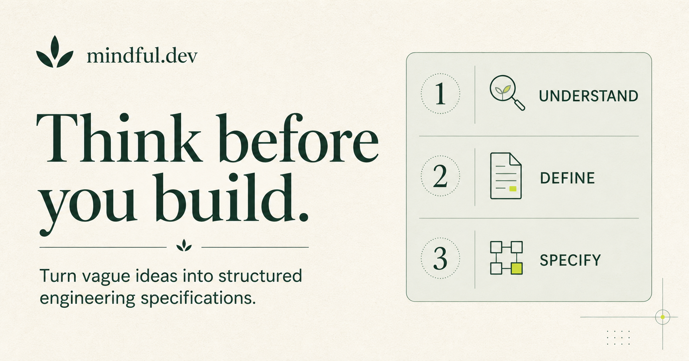

# Mindful Dev

> Think first. Build second.

Mindful Dev is a quiet, guided framework for turning vague software ideas into structured engineering specifications—before anyone writes code or asks AI to build the wrong thing.



## What it does

- Guides you through one focused question at a time
- Adapts recommendations using deterministic decision branches—no AI or API calls
- Surfaces missing information, risks, and useful clarifications
- Generates a complete, copyable Markdown engineering specification
- Saves drafts locally in your browser
- Supports skipping uncertain questions, keyboard navigation, and dark mode

Everything stays on your device. No account, backend, or tracking required.

## Run locally

Requires Node.js 22 or newer.

```bash
pnpm install
pnpm dev
```

Open [localhost:3000](http://localhost:3000). To verify a production build:

```bash
pnpm build
```

## Built with

Next.js App Router · TypeScript · React · Tailwind CSS · Zustand

## Deploy

Import the repository into Vercel and keep the detected **Next.js** framework settings. No environment variables or custom output directory are required.

## Philosophy

Most software failures begin before implementation—with an unclear problem, an undefined audience, or no shared definition of success.

Mindful Dev makes that thinking visible.

---

Built for people who would rather spend ten minutes clarifying than ten days rebuilding.
